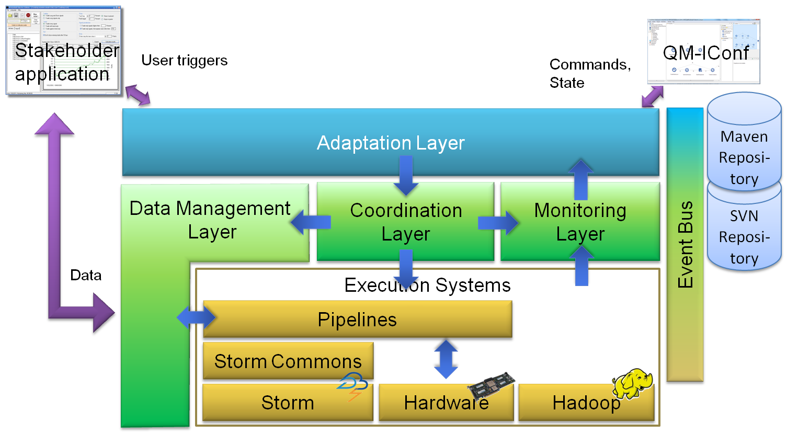

# Infrastructure
This repository contains the QualiMaster (http://qualimaster.eu) infrastructure components, i.e., a set of tools and layers on top of Apache Storm (http://storm.apache.org)
enabling a configurable and adaptive real-time data processing infrastructure. The infrastructure and the running data analysis pipeline for a certain infrastructure
installation can be configured through the QualiMaster infrastructure configuration tool (QM-IConf, https://github.com/QualiMaster/QM-IConf).

The layers and components of the infrastructure will be released incrementally. The figure below shows an overview of the architecture.

The event bus as well as the data management layer are already released. The other components will follow successively.

The QualiMaster infrastructure is open source under the Apache 2.0 license.

